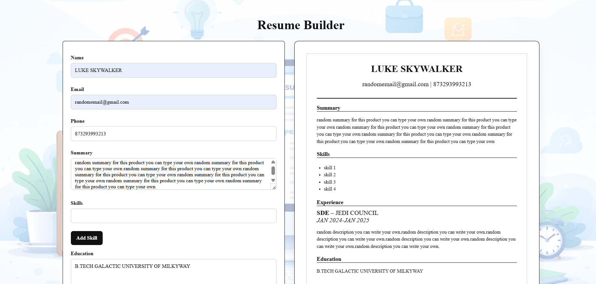

LIVE LINK: https://sweet-squirrel-84c68c.netlify.app/


# Modern Resume Builder

A premium, feature-rich web application to build professional resumes in minutes. Featuring a glassmorphism UI, real-time preview, and multiple professional templates.



## ✨ New Features

- **Modern Glassmorphism UI**: Beautiful, responsive interface with animated gradient backgrounds and glass-effect cards.
- **4 Professional Templates**:
  - **Classic**: Formal serif layout for traditional industries.
  - **Modern**: Clean sans-serif with colored sidebars for tech/creative roles.
  - **Minimal**: Elegant whitespace-focused design.
  - **Creative**: Bold colors and unique layouts for artistic portfolios.
- **Smart PDF Generation**: Downloaded PDFs automatically match your selected template's style, fonts, and colors.
- **Live Preview**: Real-time updates as you type.
- **Interactive Form**:
  - **Skill Tags**: Add/remove skills with ease.
  - **Experience Management**: Add detailed work history.
  - **Toast Notifications**: Friendly success/error messages.
- **Auto-Save**: creative use of LocalStorage preserves your work between visits.

## 🚀 How to Use

1. **Clone & Run**:
   ```bash
   git clone <repository-url>
   cd resume-builder
   npx serve .
   ```
   Or simply open `index.html` in your browser.

2. **Create Your Resume**:
   - Fill in your personal details, summary, and education.
   - Add skills using the tag input (press Enter or click +).
   - Add work experience entries.

3. **Choose Your Style**:
   - Click the template thumbnails above the preview to switch styles instantly.
   - Choose from Classic, Modern, Minimal, or Creative.

4. **Download**:
   - Click **Save Resume** to store content locally.
   - Click **Download PDF** to get your print-ready resume.

## 🛠️ Technology Stack

- **HTML5**: Semantic and accessible structure.
- **CSS3**: Variables, Flexbox/Grid, Glassmorphism, Animations.
- **JavaScript (ES6+)**: Template logic, DOM manipulation, LocalStorage.
- **jsPDF**: Client-side PDF generation.
- **Font Awesome**: Iconography.
- **Google Fonts**: Inter & Crimson Pro.

## 🎨 Customization

To modify the color schemes, edit the CSS variables in `style.css`:

```css
:root {
  --primary: #667eea;
  --accent: #06b6d4;
  --primary-gradient: linear-gradient(135deg, #667eea 0%, #764ba2 100%);
}
```

## 📄 License

MIT License - feel free to use and modify for your own projects!
